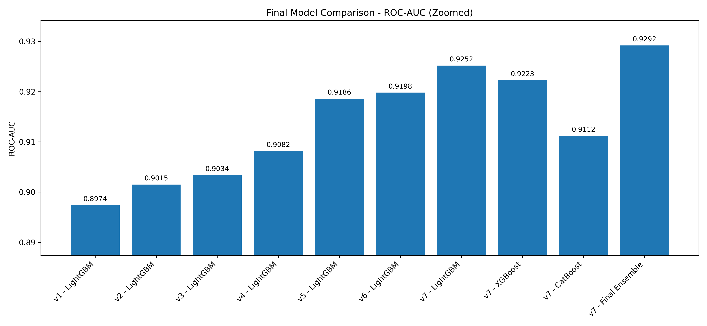
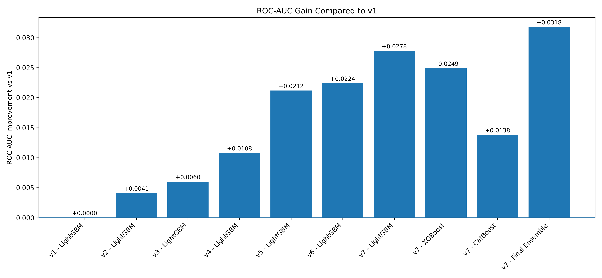
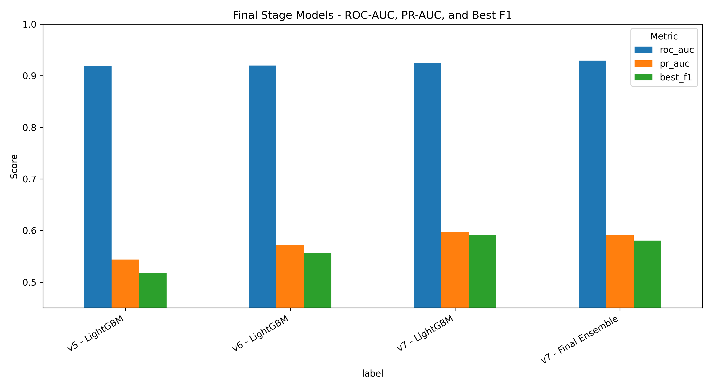
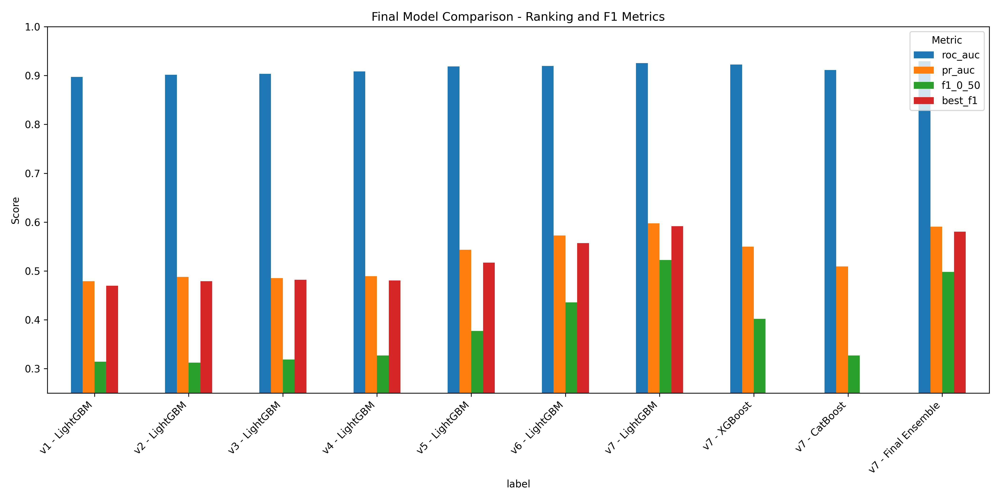
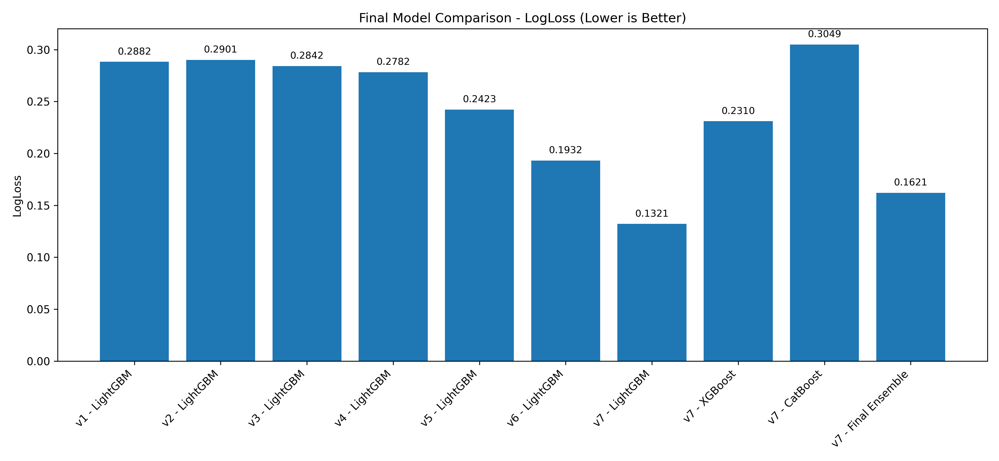
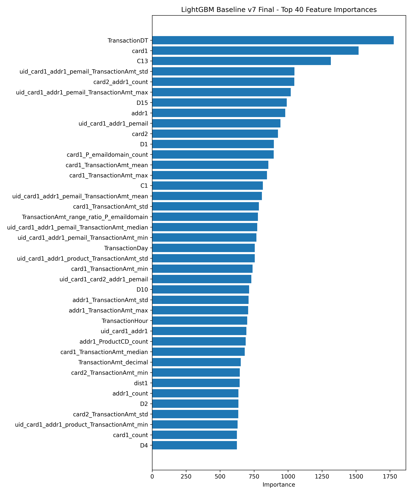
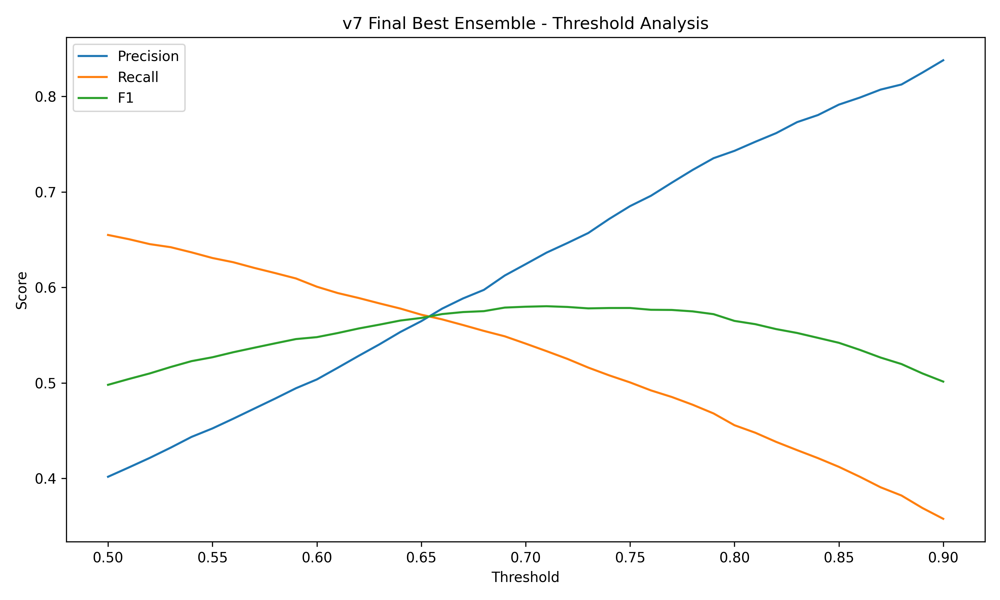

# IEEE-CIS Fraud Detection

A time-aware fraud detection pipeline for the IEEE-CIS Fraud Detection dataset. The project builds a complete machine learning workflow using structured tabular data, leakage-safe feature engineering, LightGBM, XGBoost, CatBoost, and weighted ensemble learning.

The final model reaches a validation ROC-AUC of **0.9292** using a weighted ensemble of LightGBM, XGBoost, and CatBoost.

## Project Overview

The objective is to predict whether an online transaction is fraudulent.

| Target | Meaning |
|---|---|
| `isFraud = 0` | Non-fraud transaction |
| `isFraud = 1` | Fraud transaction |

This is a binary classification problem with strong class imbalance. Fraudulent transactions represent only a small proportion of the dataset, so accuracy alone is not sufficient. The project uses ROC-AUC as the main metric, while also reporting PR-AUC, LogLoss, precision, recall, F1-score, and threshold-based results.

## Dataset

The project uses the Kaggle IEEE-CIS Fraud Detection dataset.

Expected raw files:

| File | Description |
|---|---|
| `train_transaction.csv` | Main transaction training data |
| `train_identity.csv` | Identity and device information for a subset of train transactions |
| `test_transaction.csv` | Main transaction test data |
| `test_identity.csv` | Identity and device information for a subset of test transactions |
| `sample_submission.csv` | Kaggle sample submission format |

The raw data files are not included in this repository because they are large Kaggle files. To reproduce the project, download them from Kaggle and place them in:

```text
DATA/raw/
```

or, using this repository structure:

```text
data/raw/
```

## Validation Strategy

A time-aware validation strategy was used instead of a random split.

The dataset was sorted using `TransactionDay`. The first 80% of the observations were used for training, and the last 20% were used for validation.

This is important because fraud detection is time-dependent. A random split can create overly optimistic results if future-like information leaks into training.

| Split | Description |
|---|---|
| Train | First 80% of transactions by time |
| Validation | Last 20% of transactions by time |

## Feature Engineering

The project started from a controlled baseline and gradually added stronger feature groups.

### Time Features

Derived from `TransactionDT`:

| Feature | Description |
|---|---|
| `TransactionDay` | Transaction day derived from `TransactionDT` |
| `TransactionHour` | Hour of transaction |
| `TransactionWeek` | Week index derived from transaction day |

### Email Features

Derived from `P_emaildomain` and `R_emaildomain`:

| Feature | Description |
|---|---|
| `P_email_missing` | Whether purchaser email domain is missing |
| `R_email_missing` | Whether recipient email domain is missing |
| `same_email_domain` | Whether purchaser and recipient domains are the same |
| `P_email_group` | Grouped purchaser email domain |
| `R_email_group` | Grouped recipient email domain |

Email domains were grouped into categories such as `gmail`, `yahoo`, `hotmail`, `anonymous`, `aol`, `outlook`, `apple`, `mail`, `other`, and `Missing`.

### Transaction Amount Features

Derived from `TransactionAmt`:

| Feature | Description |
|---|---|
| `TransactionAmt_log` | `log1p(TransactionAmt)` |
| `TransactionAmt_decimal` | Decimal part of transaction amount |
| `TransactionAmt_is_round` | Whether amount is a round number |
| `TransactionAmt_cents` | Approximate cents/fractional amount component |

### Frequency Features

Frequency features count how often a value appears in the training data. These were computed on the training split only and mapped to validation to avoid leakage.

Examples:

| Feature | Description |
|---|---|
| `card1_count` | Frequency of each `card1` value in train |
| `card2_count` | Frequency of each `card2` value in train |
| `card3_count` | Frequency of each `card3` value in train |
| `card5_count` | Frequency of each `card5` value in train |
| `addr1_count` | Frequency of each `addr1` value in train |
| `addr2_count` | Frequency of each `addr2` value in train |

### Identity and Device Features

High-cardinality identity strings were grouped into simpler categories.

| Feature | Source | Description |
|---|---|---|
| `OS_group` | `id_30` | Simplified operating system group |
| `Browser_group` | `id_31` | Simplified browser group |
| `DeviceInfo_group` | `DeviceInfo` | Simplified device/manufacturer group |
| `screen_width` | `id_33` | Extracted screen width |
| `screen_height` | `id_33` | Extracted screen height |
| `has_identity` | identity merge | Whether identity data exists for the transaction |

### UID-Style Features

UID-style features are artificial identifiers created by combining multiple transaction fields. They approximate user, card, or account behavior without having a real user ID.

For example:

```python
uid_card1_addr1 = str(card1) + "_" + str(addr1)
```

If `card1 = 13926` and `addr1 = 315`, then:

```text
uid_card1_addr1 = "13926_315"
```

UID features created in the final version:

| UID Feature | Construction |
|---|---|
| `uid_card1_addr1` | `card1 + addr1` |
| `uid_card1_card2_addr1` | `card1 + card2 + addr1` |
| `uid_card1_addr1_pemail` | `card1 + addr1 + P_emaildomain` |
| `uid_card1_card2_addr1_pemail` | `card1 + card2 + addr1 + P_emaildomain` |
| `uid_card1_addr1_product` | `card1 + addr1 + ProductCD` |
| `uid_card1_card2_addr1_product` | `card1 + card2 + addr1 + ProductCD` |

These features help the model learn whether a transaction is unusual relative to a specific card-address-email or card-address-product pattern.

### Aggregation Features

Transaction amount aggregation features were created using training-only group statistics.

Groups used included:

- `card1`
- `card2`
- `addr1`
- `P_emaildomain`
- `ProductCD`
- UID-style features

For each group, the following statistics were created:

| Statistic | Example |
|---|---|
| Mean | `card1_TransactionAmt_mean` |
| Standard deviation | `card1_TransactionAmt_std` |
| Median | `card1_TransactionAmt_median` |
| Minimum | `card1_TransactionAmt_min` |
| Maximum | `card1_TransactionAmt_max` |

Relative amount features were also created:

| Feature Pattern | Meaning |
|---|---|
| `TransactionAmt_minus_<group>_mean` | Difference from group mean |
| `TransactionAmt_ratio_<group>_mean` | Ratio to group mean |
| `TransactionAmt_zscore_<group>` | Standardized amount within group |
| `TransactionAmt_range_ratio_<group>` | Position within group min-max range |

These aggregation features became some of the strongest predictors in the final model.

## Modeling Strategy

The project tested several model versions from v1 to v7.

| Version | Main Strategy |
|---|---|
| v1 | Controlled LightGBM baseline |
| v2 | Added email-derived features |
| v3 | Added transaction amount features |
| v4 | Added `card1_count` |
| v5 | Expanded memory-safe feature set |
| v6 | Added interaction-count and amount aggregation features |
| v7 | Added UID-style features, stronger aggregations, and ensemble learning |

The final version used:

- LightGBM
- XGBoost
- CatBoost
- Weighted probability ensemble

## Final Results

### Model Comparison

| Version | Model | ROC-AUC | PR-AUC | LogLoss | F1 at 0.50 | Best F1 |
|---|---|---:|---:|---:|---:|---:|
| v1 | LightGBM | 0.8974 | 0.4790 | 0.2882 | 0.3145 | 0.4696 |
| v2 | LightGBM | 0.9015 | 0.4880 | 0.2901 | 0.3124 | 0.4789 |
| v3 | LightGBM | 0.9034 | 0.4852 | 0.2842 | 0.3189 | 0.4819 |
| v4 | LightGBM | 0.9082 | 0.4891 | 0.2782 | 0.3271 | 0.4805 |
| v5 | LightGBM | 0.9186 | 0.5436 | 0.2423 | 0.3770 | 0.5172 |
| v6 | LightGBM | 0.9198 | 0.5725 | 0.1932 | 0.4358 | 0.5568 |
| v7 | LightGBM | 0.9252 | 0.5977 | 0.1321 | 0.5223 | 0.5916 |
| v7 | XGBoost | 0.9223 | 0.5495 | 0.2310 | 0.4021 | N/A |
| v7 | CatBoost | 0.9112 | 0.5091 | 0.3049 | 0.3269 | N/A |
| v7 | Final Ensemble | 0.9292 | 0.5905 | 0.1621 | 0.4981 | 0.5804 |

### Final Champion

The final champion by ROC-AUC is the v7 weighted ensemble.

| Model | Weight |
|---|---:|
| LightGBM | 0.70 |
| XGBoost | 0.20 |
| CatBoost | 0.10 |

Final ensemble results:

| Metric | Value |
|---|---:|
| ROC-AUC | 0.9292 |
| PR-AUC | 0.5905 |
| LogLoss | 0.1621 |
| F1 at threshold 0.50 | 0.4981 |
| Best threshold | 0.71 |
| Best F1 | 0.5804 |

### Best Single Model

The best single model was LightGBM v7.

| Metric | Value |
|---|---:|
| ROC-AUC | 0.9252 |
| PR-AUC | 0.5977 |
| LogLoss | 0.1321 |
| F1 at threshold 0.50 | 0.5223 |
| Best threshold | 0.70 |
| Best F1 | 0.5916 |

The final ensemble produced the highest ROC-AUC, while LightGBM v7 produced the strongest single-model operational F1.

## Visual Results

### ROC-AUC Progress



### ROC-AUC Gain vs Baseline



### Final Stage Model Comparison



### Ranking Metrics



### LogLoss Comparison



### LightGBM v7 Feature Importance



### v7 Ensemble Threshold Analysis



## Repository Structure

```text
ieee-fraud-detection/
│
├── README.md
├── requirements.txt
├── .gitignore
│
├── data/
│   ├── raw/              # Kaggle raw data, not tracked by Git
│   ├── processed/        # Generated processed CSVs, not tracked by Git
│   └── interim/
│
├── notebooks/
│   ├── 01_data_understanding.py
│   ├── 02_identity_understanding.py
│   ├── 03_email_feature_understanding.py
│   └── dataset_notes.md
│
├── src/
│   ├── data_loading_and_inspection.py
│   ├── data_preparation.py
│   ├── preprocessing_baseline_v1.py
│   ├── modeling_baseline_v1.py
│   ├── modeling_baseline_v2.py
│   ├── modeling_baseline_v3.py
│   ├── modeling_baseline_v4.py
│   ├── modeling_baseline_v5_from_raw_memory_safe.py
│   ├── modeling_baseline_v6_from_raw_memory_safe.py
│   ├── modeling_baseline_v7_final.py
│   └── final_model_comparison.py
│
├── outputs/
│   ├── figures/
│   └── metrics/
│
└── reports/
    └── final_project_summary.md
```

## Reproducibility

Install dependencies:

```bash
pip install -r requirements.txt
```

Place the Kaggle raw files in:

```text
data/raw/
```

Run the final model script:

```bash
python src/modeling_baseline_v7_final.py
```

Run final comparison and generate summary plots:

```bash
python src/final_model_comparison.py
```

## Key Takeaways

- Time-aware validation was used to reduce optimistic evaluation.
- Feature engineering improved ROC-AUC from 0.8974 to 0.9292.
- UID-style features and transaction amount aggregations were highly effective.
- The final ensemble achieved the best ROC-AUC.
- LightGBM v7 was the strongest single model and achieved the best operational F1.
- The project demonstrates a complete end-to-end tabular fraud detection workflow suitable for portfolio presentation.
